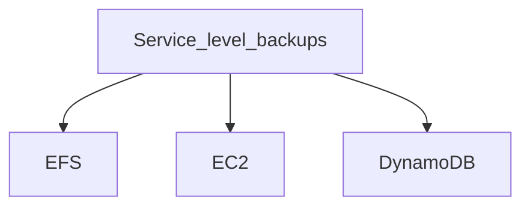
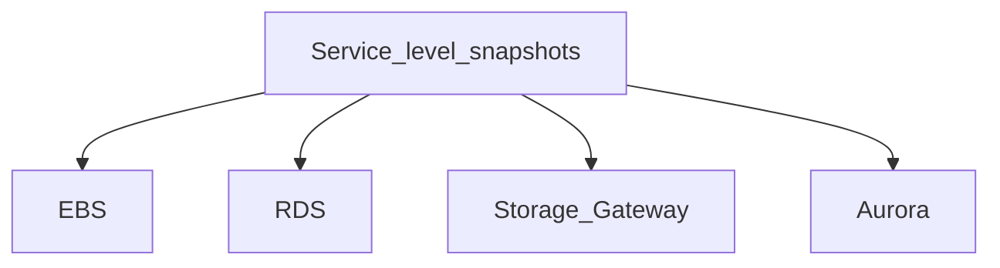

### What is AWS Backup?
- AWS Backup is a fully-managed service that makes it easy to centralize and automate data protection across AWS services, in **the cloud**, **and on premises**. 
- using this service, you can configure **backup policies** and **monitor activity** for your AWS resources in one place. 
- It allows you to 
  - **automate** and **consolidate** backup tasks that were previously performed service-by-service, 
  - **removes** the need to create custom scripts and manual processes. 
  - with a few clicks in the AWS Backup console, you can automate your data protection policies and schedules.

**Support AWS resources**
- EFS
- EC2
- DynamoDB
- EBS
- RDS
- Storage Gateway
- Aurora

|---------------------|----------------|
| :one:               | :two:          |
|---------------------|----------------|

------------------

------------------

**Service level backup** - uses default backup mechanism of each service not of these services the first three services are backed by using service layer 

**Service level snapshots** - whenever we take a backup of for example EBS volumes we always curse(need fix) snapshots of the volumes and similarly when we take the backup of EFS we don't create the snapshots but we take the backup of the files which are stored in EFS shared 

**Backup vaults** 
- is a **container** which stores all of your backups 
- you have to create multiple vaults in order to manage backups
- e.i if we have an app called myapp then we should create one vault for my this app and all the resources belonged to my app

**Backup plans** 
- it allows us to configure when to take the backups 
  - we can define the frequency of taking the backups 
  - for how long we want to retain those backups  
