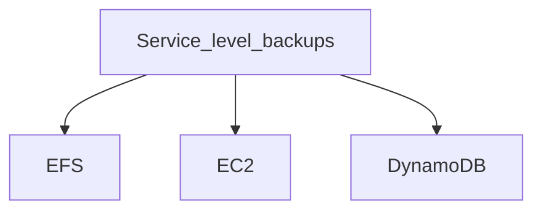

### What is AWS Backup?
- AWS Backup is a fully-managed service that makes it easy to centralize and automate data protection across AWS services, in **the cloud**, **and on premises**. 
- using this service, you can configure **backup policies** and **monitor activity** for your AWS resources in one place. 
- It allows you to 
  - **automate** and **consolidate** backup tasks that were previously performed service-by-service, 
  - **removes** the need to create custom scripts and manual processes. 
  - with a few clicks in the AWS Backup console, you can automate your data protection policies and schedules.

**Support AWS resources**
- EFS
- EC2
- DynamoDB
- EBS
- RDS
- Storage Gateway
- Aurora

|---------------------|----------------|
| :one:               | :two:          |
|---------------------|----------------|



```mermaid
graph TD;
  Service_level_snapshots-->EBS;
  Service_level_snapshots-->RDS;
  Service_level_snapshots-->Storage Gateway;
  Service_level_snapshots-->Aurora;
```

{+ addition 1 +}