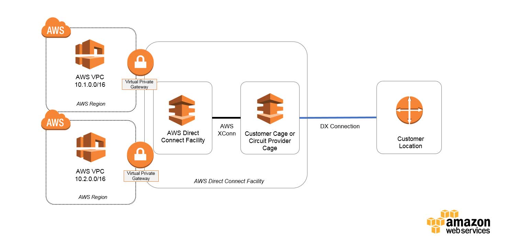
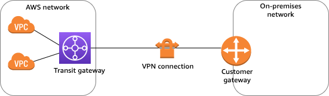
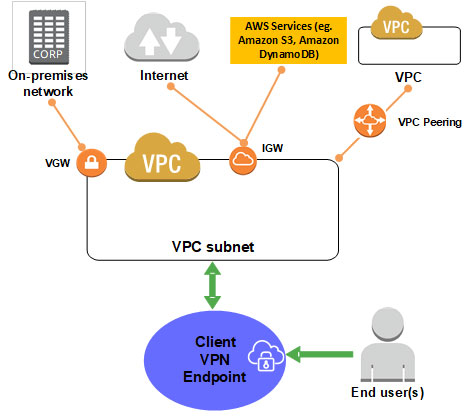

**1. Как дать доступ к Endpoint из on-prem? (Нужно разобраться в деталях Site-to-site VPN, Virtual Private Gateway, Route table, Endpoints, DNS resolver)**

**:one: Connect Your Data Center to AWS (Direct Connect)**

   

   - **AWS Direct Connect** enables you to securely connect your AWS environment to your on-premises data centre 

   - over a standard **1Gb** or **10Gb** Ethernet fibre-optic connection. 

   - AWS Direct Connect offers dedicated **high speed**, l**ow latency** connection, which bypasses internet service providers in your network path. 

   - an AWS Direct Connect location provides access to Amazon Web Services in the region it is associated with, as well as access to other US regions. 

   - AWS Direct Connect allows you to logically partition the fibre-optic connections into multiple logical connections called Virtual Local Area Networks (VLAN). 

   - you can take advantage of these logical connections to improve security, differentiate traffic, and achieve compliance requirements.

**:two: Using Site-to-Site VPN, between the on-premises network and AWS**

   

   - this solution is much quicker to implement providing that already you have a pair of **Firewalls** or **Routers** (with VPN accelerator hardware) in **High-Availability** mode connected to the Internet, usually at your Extranet Block.
   
   - by default, instances that you launch into an Amazon **VPC can’t communicate** with your own (remote) network. 
   - you can enable access to your remote network from your **VPC** by creating an **AWS Site-to-Site** VPN (**Site-to-Site VPN**) connection, and configuring **routing** to pass traffic through the connection.
   
   - although the term VPN connection is a general term, in this documentation, a **VPN connection** refers to the connection between your **VPC** and your **own on-premises network**. 
   - **Site-to-Site VPN** supports **Internet Protocol security** (**IPsec**) VPN connections. 
   
   - a **Site-to-Site VPN** connection offers two (`Active/Standby`) VPN tunnels between a virtual private gateway or a transit gateway on the AWS side, and a customer gateway on the remote (on-premises) side. 

**:three: Using Client VPN**

   

   - network team, administrators are responsible for setting up and configuring the services, 
   - once downloaded the **Client VPN** endpoint configuration file is distributed to end-users that require this service. 
   - they will be able to connect directly to AWS and services hosted in **VPC** for the organisation

   - the client is the end-user. this is the person who connects to the Client VPN endpoint to establish a VPN session. 
   
   - the client establishes the VPN session from their local computer or mobile device using an **OpenVPN-based VPN client** application. 
   
   - after they have established the VPN session, they can securely access the resources in the VPC in which the associated subnet is located. 
   - they can also access other resources in AWS or an on-premises network if the required route and authorization rules have been configured. 

**:four: Site-to-Site VPN routing options**

   -  When you create a Site-to-Site VPN connection, you must do the following:
      -  Specify the type of routing that you plan to use (**static or dynamic**)
      -  Update the route table for your subnet

   - **Static and dynamic routing**
     - the type of routing that you select can depend on the make and model of your customer gateway device. 
     - if your customer gateway device **supports** `Border Gateway Protocol` (BGP), specify **dynamic** routing 
     - if your customer gateway device **does not support** `BGP`, specify **static** routing.

     - we recommend that you use BGP-capable devices, when available, because the BGP protocol offers **robust liveness detection** checks that can assist failover to the second VPN tunnel if the first tunnel goes down. 
     - devices that don't support BGP may also perform health checks to assist failover to the second tunnel when needed. 

**:five: Route tables and VPN route priority**
   - **Route Table**
     - it determines where network traffic from your VPC is directed. 

     - in your VPC route table, you must add a route for your remote network and specify the virtual private gateway as the target.

     - this enables traffic from your VPC that's destined for your remote network to route via the virtual private gateway and over one of the VPN tunnels. 

     - you can enable route propagation for your route table to automatically propagate your network routes to the table for you.

## Practice

### **Access to an on-premises network**

#### Before you begin, do the following:**

   - **create** or **identify** a **VPC** with at **least one subnet**. 
   - identify the subnet in the VPC that you want to associate with the **Client VPN endpoint** and note its IPv4 CIDR ranges.

   - identify a suitable **CIDR range** for the client IP addresses that does not overlap with the VPC CIDR.

   - review the rules and limitations for Client VPN endpoints in Limitations and rules of Client VPN.

#### To implement this configuration

- To set up a Site-to-Site VPN connection using a **virtual private gateway**, complete the following steps:
  - Step 1: Create a **customer gateway**
  - Step 2: Create a **target gateway**
  - Step 3: Configure routing
  - Step 4: Update your security group
  - Step 5: Create a Site-to-Site VPN connection
  - Step 6: Download the configuration file
  - Step 7: Configure the customer gateway device

- You need the following information to set up and configure the components of a **Site-to-Site VPN** connection.
  - **:one: Customer gateway device** - 
    - the physical or software device on your side of the VPN connection. 
    - you need the vendor (for example, Cisco), platform (for example, ISR Series Routers), and software version (for example, IOS 12.4).
  - **:two: Customer gateway** - 
    - To create the customer gateway resource in AWS, you need the following information:
      - The internet-routable IP address for the device's external interface
      - The type of routing: static or dynamic
        - For dynamic routing, the Border Gateway Protocol (BGP) Autonomous System Number (ASN)
  - **:three: VPN connection** - 
    - To create the VPN connection, you need the following information:
      - For static routing, the IP prefixes for your private network.
      - (Optional) Tunnel options for each VPN tunnel. For more information, see Tunnel options for your Site-to-Site VPN connection.

- To establish a VPN connection between your VPC and your on-premises network, you must create a **target gateway** on the AWS side of the connection. 
- the target gateway can be a **virtual private gateway** or a **transit gateway**.
- after you create a virtual private gateway, you must attach it to your VPC.

