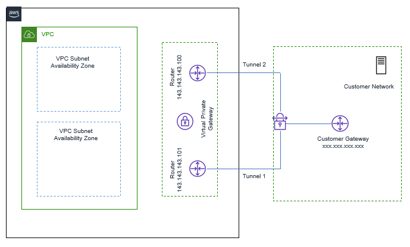
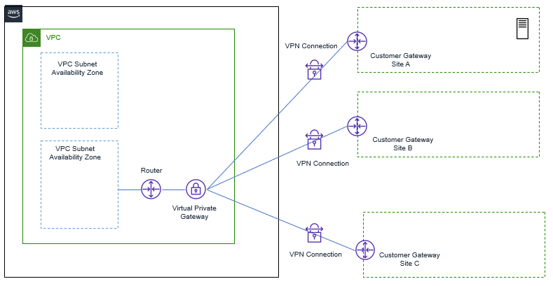
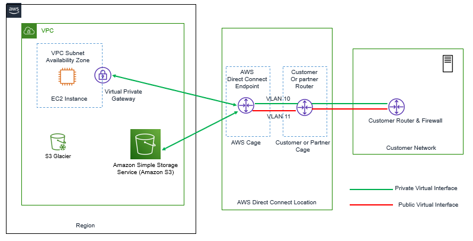

### Connecting AWS & On-premises Network

**If we want to connect our On-Premises network to another Network in WAN, below are some options available**

**Connectivity via Internet**
- Via VPN Client, user can connect to office and Application
- Via Site-to-Site VPN, to connect from one location to another location
- Via Leased Line or Optical Fiber to connect collocation and DC Sites.

**In AWS, there are two options available for connecting on-premises network to VPC.**

- :one: Direct Connect
- :two: VPN with Virtual Gateway

**:one: Connecting On-Premises with VPC via VPN (Virtual Private Gateway)**
    
    Amazon VPN gateway is very cost-effective Managed Service Solution available to connect the On-Premises to AWS VPC. VPN gateway is logical network gateway device, which establish IPSec VPN tunnel from AWS VPN to on-Premises VPN Device.

    For each VPN connection, two public tunnel endpoints are created, which enables automatic failover from VPN Gateway device, as shown in below figure

    

    With this Service, from one VPN gateway, we can be able to connect to Multiple remote sites, but no transient traffic can pass through VPN gateway.

    

**VPN Gateway Limits**
- By Default, Each AWS Account, has limit to create up to 50 Site-to-Site Connection Per region and up to 10 Site-to-Site connection Per VGW.

- The VGW supports NAT Traversal out of box, can be configured to use 2–4-byte ASN.

- Each VGW supports 1.25 GBps throughput via IPSec VPN.   

**Securing VPN**

**Each AWS VPN IPSec tunnel supports following protocols for Authentication, Key Exchange, Traffic transmission phase.**

- IKEv2 and AES256 Encryption
- SHA-2 Hashing
- Diffie-Hellman groups.

Now for traffic between Server & Client, which are not on VPN, for those type of traffic ( traffic with in VPC or traffic inside on-Premises) , security can be achieved by using HTTPS, SSL Encryption or TDE for database.

**:two: Connecting On-Premises with VPC via Direct Connect**

- When we see that we cannot meet our throughput requirement via VGW or to use huge Virtual instance of VGW for our throughput requirement, it will not be economical.

- In that case, we can use better option, to have fast, reliable, Private link – called AWS direct Connect.

- AWS Direct connect allow us to establish a dedicated layer 2 network connection between your network and Direct connect Location rack.

**- When there are following requirement as mentioned below, we can use Direct Connection Services**
  - Lower Latency
  - Predictable Performance
  - Higher throughput
  - Large amount of data, needs to be transferred daily between on-Premises and AWS
  - Security & Compliance requirement, for not to use Internet Link.

Below dig shows how AWS Direct Connect can be used to connect AWS VPC to On-Premise’s network.

    

**Requirement of Direct Connect Solution**

- In Order to use the AWS Direct Connect Solution , Customer must be located in an area which are being serviced by an AWS Direct Connect partner.
- Need for device, that support Single-Mode Fiber Connection with 1000BASE-LX or 10GBASE-LR transceiver.
- Device must support , Port Speed and full duplex mode configuration manually .
- Device must support BGP , BGP MD5 Authentication along with 802.1Q VLAN Encapsulation across entire connection.