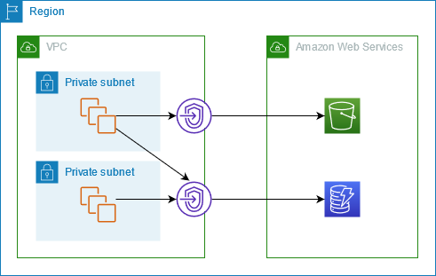

**1. Какие есть зарезервированные IP адреса в  subnet, сколько их, для чего используются**

- `10.0.0.0:` 
  - **Network address.**

- `10.0.0.1:` 
  - **Reserved by AWS for the VPC router.**

- `10.0.0.2:` 
  - **Reserved by AWS**. 
 
  - the **IP address of the DNS server** is the base of the VPC network range plus two. 
 
  - for VPCs with multiple CIDR blocks, the IP address of the DNS server is located in the primary CIDR.
 
  - we also reserve the base of each subnet range plus two for all CIDR blocks in the VPC. 
 
  - for more information, see Amazon DNS server.

- `10.0.0.3:` 
  - **Reserved by AWS for future use**.

- `10.0.0.255:` 
  - network broadcast address. 
 
  - we do not support broadcast in a VPC, therefore we reserve this address.

**2. Что такое VPC Endpoints?** 
  1. Какие есть? 
  2. Как используются и как настраиваются? 
  3. (Gateway Endpoint, Interface  Endpoint нужно достаточно хорошо понимать отличия и процесс настройки, в том числе DNS записи)
   
- a VPC endpoint enables customers to privately connect to supported AWS services and VPC endpoint services powered by AWS PrivateLink. 

- Amazon VPC instances do not require public IP addresses to communicate with resources of the service.

- Traffic between an Amazon VPC and a service does not leave the Amazon network.

- VPC endpoints are virtual devices. 
- they are horizontally scaled, redundant, and highly available Amazon VPC components that allow communication between instances in an Amazon VPC and services without imposing availability risks or bandwidth constraints on network traffic. 
- there are two types of VPC endpoints:
  - interface endpoints
  - gateway endpoints

- **Interface endpoints**
  - it enables connectivity to services over AWS PrivateLink. 
  
  - these services include some AWS managed services, services hosted by other AWS customers and partners in their own Amazon VPCs (referred to as endpoint services), and supported AWS Marketplace partner services. 
  
  - the owner of a service is a service provider. 
  
  - the principal creating the interface endpoint and using that service is a serviceconsumer.
  
  - an interface endpoint is a collection of one or more elastic network interfaces with a private IP address that serves as an entry point for traffic destined to a supported service.

- **Gateway endpoints**
  - a gateway endpoint targets specific IP routes in an Amazon VPC route table, in the form of a prefix-list, used for traffic destined to Amazon DynamoDB or Amazon Simple Storage Service (Amazon S3). Gateway endpoints do not enable AWS PrivateLink.

  - gateway endpoints provide reliable connectivity to Amazon S3 and DynamoDB without requiring an internet gateway or a NAT device for your VPC. Gateway endpoints do not enable AWS PrivateLink.
  - **access through a gateway endpoint**
    - the following diagram shows how instances access Amazon S3 and DynamoDB through a gateway endpoint. Traffic from your VPC to Amazon S3 or DynamoDB is routed to the gateway endpoint. 
    
    - each subnet route table must have a route that sends traffic destined for the service to the gateway endpoint using the prefix list for the service.

