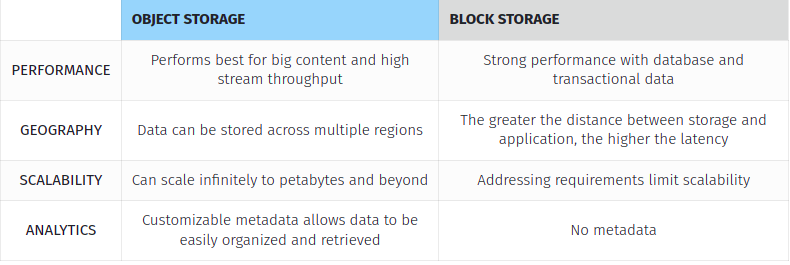

**13. Каким типом дискового хранилища является EBS?** 
- Block storage, для сравнения S3 -  object storage

**What is block storage?**
- block storage is technology that controls data storage and storage devices. 
- it takes any data, like a file or database entry, and divides it into blocks of equal sizes. 
- the block storage system then stores the data block on underlying physical storage in a manner that is optimized for fast access and retrieval. 
- developers prefer block storage for applications that require efficient, fast, and reliable data access. 
- think of block storage as a more direct pipeline to the data. 
- by contrast, file storage has an extra layer consisting of a file system (NFS, SMB) to process before accessing the data.

What are the use cases of block storage?
Storage area networks
Containers
Transactional workloads
Virtual machines

What other types of storage are available?
**Object storage**

- Object storage is a technology that stores and manages data in an unstructured format called objects. Each object is tagged with a unique identifier and contains metadata that describes the underlying content. For example, object storage for photos contains metadata regarding the photographer, resolution, format, and creation time. Developers use object storage to store unstructured data, such as text, video, and image

- **File storage**

- File storage stores data in a hierarchical structure of files and folders. In network environments, file-based storage often uses network-attached storage (NAS) technology. NAS allows users to access network storage data in similar ways to a local hard drive. File storage is user-friendly and allows users to manage file-sharing control.

**Instance storage**

- An instance store provides temporary block-level storage for your instance. This storage is located on disks that are physically attached to the host computer. Instance store is ideal for temporary storage of information that changes frequently, such as buffers, caches, scratch data, and other temporary content, or for data that is replicated across a fleet of instances, such as a load-balanced pool of web servers.

- An instance store consists of one or more instance store volumes exposed as block devices. The size of an instance store as well as the number of devices available varies by instance type

**Amazon EBS vs. Amazon S3**

Amazon EBS is the AWS block storage offering and Amazon S3 is the AWS object storage offering. So the question is: Amazon EBS or Amazon S3?

- You might want to consider the following key differences when making a  decision for your cloud storage systems:
  
  - Access: Amazon EBS can be accessed with an Amazon EC2 instances only, while Amazon S3 can be accessed over the Internet directly. You can use file system applications such as S3fs or goofys, which allow you to mount an Amazon S3 bucket; however, because they’re not native options, they have some limitations (such as the file size when using S3fs).
  
  - Scale: Scaling cloud block storage generally involves setting up a distributed file system or a RAID of multiple volumes. Amazon EBS offers Amazon EBS volumes of up to 16 TB in size, and you can RAID a few volumes together to suit your needs. Still, this is a complicated process compared to the way object-based storage works. In comparison, one Amazon S3 object can be 5 TB and you can store unlimited objects of 5 TB in Amazon S3
  
  - Speed: The IO is a good deal faster on Amazon EBS than on Amazon S3, because Amazon EBS is attached to the Amazon EC2 instance as a file system and relies on NAS protocol. It supports various volume types (gp2,io1, st1, and sc1, each for a different budget and need) that can help achieve increase IO performance with guaranteed IOPS based on SSD, such as PIOPS and General Purpose.
  
  - Versioning: With Amazon S3, the Amazon object storage service, maintaining multiple versions/revisions of objects stored in file is a lot simpler and cost-effective as compared to Amazon EBS, where you have to make a snapshot of entire disk.
 
  - Price: Amazon S3 is significantly cheaper than Amazon EBS. For example, storing 100 GB of data on Amazon S3 will cost around $3, as compared to around $10 a month on general purpose SSD Amazon EBS

**What is block storage?**
- **Block storage** chops data into blocks—get it?
- and stores them as separate pieces. 
- each block of data is given a unique identifier, which allows a storage system to place the smaller pieces of data wherever is most convenient. 
- that means that some data can be stored in a Linux® environment and some can be stored in a Windows unit.

**What is object storage?**
- **Object storage**, also known as object-based storage, is a flat structure in which files are broken into pieces and spread out among hardware. 
- **In object storage**, the data is broken into discrete units called objects and is kept in a single repository, instead of being kept as files in folders or as blocks on servers.
- Object storage volumes work as modular units: each is a self-contained repository that owns the data, a unique identifier that allows the object to be found over a distributed system, and the metadata that describes the data.

**Object Storage Use Cases**
**Object storage is mainly used for:**

**Storing big data**. 
  - Object storage, due to its metadata capabilities, scalability, and robust API works excellent for machine learning. Storing and accessing unstructured data is where object storage excels at.

**Creating backup copies and archives**. 
  - Object storage is a reliable option for data sets that aren’t updated often. 
  - Users who are not leveraging a supported backup utility (Veeam, R1Soft) can leverage the S3 interface for their backups.

**Media and entertainment data storage.** 
  - This storage solution excels at storing high volumes of images, graphics, video, or audio files. 
  - Most importantly, it makes them accessible to users anywhere in the world at lightning speed.

**Data storage with ransomware protection**. 
  - Object storage creates a new version of the same file after each modification allowing you to restore data in case of a ransomware attack.

**Storing personal medical files**. 
  - Thanks to its built-in security and resilient replication, object storage is used for protecting personal medical data. Additionally, some object storage solutions are HIPAA-compliant by default, a critical factor when storing personal medical files. 

**Hosting a Static Website**. 
  - Object storage is a suitable environment for hosting a static website that scales automatically to meet traffic demands. Using object storage

**Block Storage Use Cases**
**Block storage is primarily used for:**

**Database storage**. 
  - Object storage provides consistent I/O performance, low latency, redundancy, and fault tolerance, making them ideal for resource intensive database applications.

**Storing data for applications that require service-side processing**. 
  - Applications that require server-side processing (such as Java, PHP, and .Net) require using block storage.

**RAID volumes**. 
  - RAID arrays are a common use case for block storage as this storage solution stores data on multiple disks organized by stripping or mirroring. Therefore, you can employ block storage as RAID volumes.

**Container storage**. 
- Block storage help with managing data stored in Docker or Kubernetes container by separating the data from the lifecycle of the container or pod and providing fixed-sized persistent storage.

**Storing mission-critical applications**. 
- Block storage is a common choice for applications that deal with mission-critical data. Its excellent performance and low latency ensure the app functions continuously as required.