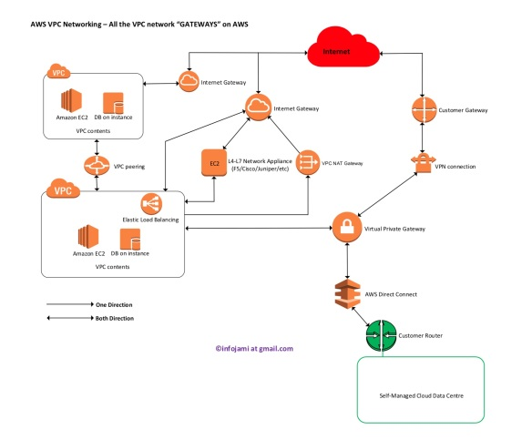

**6. Какие вы знаете VPC Gateways?** 
    - Internet Gateway, 
    - NAT gateway, 
    - Transit Gateway, 
    - Virtual Private Gateway, 
    - Direct Connect Gateway 
- стоит разобраться в специфике каждого из них, для чего используется, как настраивается

There are many different type of gateways (**network routers**) on AWS VPC networking. 
Each of them have different roles – you put together different gateways to make a complete solution. 
Gateways are key components of a routing table – here I will show all the gateway items available on a “VPC routing table”.
    

Following diagram shows all the different types of gateways/routers on AWS VPC platform (follow the traffic path arrow head):

**1. Virtual Private Gateway (VGW-nn)**
This is a multi-purpose network gateway appliance provides in/out routing to a VPC. 
Key attributes of VGW:

- this is a multi-purpose network gateway appliance provides in/out routing to a VPC

- the destination networks can be via AWS DirectConnect to a self-managed data centre or can be over IPSec VPN (via AWS VPN connections) 

- for IPSec VPN – an AWS “VPN connection” object need to be attach to VGW

- for IPSec VPN – supported routing protocols are BGP and Static

- for AWS DirectConnect connection – VLAN tagged virtual interfaces (VIFs) are needs to be created for IP routing and attached to VGW

- for AWS DirectConnect connection – BGP is only supported routing protocol when more then one interfaces available ECMP is configured by default for both IPSec VPN and DirectConnect while sending traffic from AWS to a remote destination
BGP path selection can be manipulated by “AS path prepending” sending from the source to AWS
“VGW” instances are available within VPC routing table to be set as target