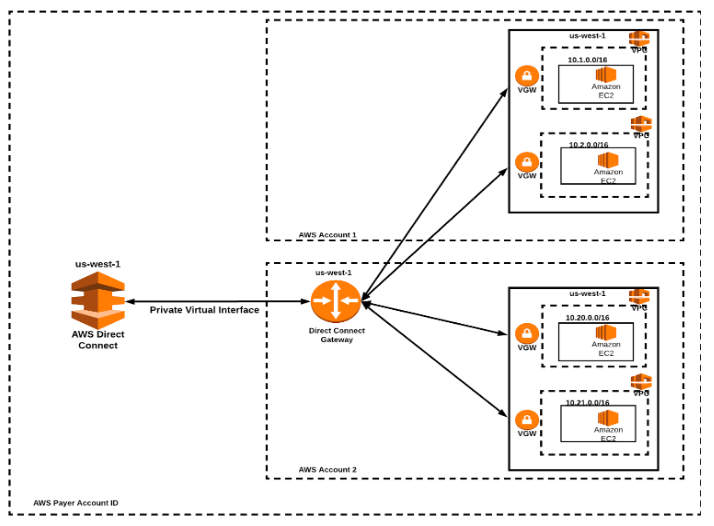

**6. Какие вы знаете VPC Gateways?** 
    - Internet Gateway, 
    - NAT gateway, 
    - Transit Gateway, 
    - Virtual Private Gateway, 
    - Direct Connect Gateway 
- стоит разобраться в специфике каждого из них, для чего используется, как настраивается

- The subnets within a VPC each need a route table, 
- each route table needs at least one route defined within them. 
- these tell the VPC how to route traffic.

**Gateway endpoints** 
- provide reliable connectivity to Amazon S3 and DynamoDB without requiring an internet gateway or a NAT device for your VPC. 
- gateway endpoints do not enable AWS PrivateLink.

There are many different type of gateways (**network routers**) on AWS VPC networking. 
Each of them have different roles – you put together different gateways to make a complete solution. 
Gateways are key components of a routing table – here I will show all the gateway items available on a “VPC routing table”.

Following diagram shows all the different types of gateways/routers on AWS VPC platform (follow the traffic path arrow head):

**1. Virtual Private Gateway (VGW-nn)**

VGW became known as a solution that reduces the expense of establishing new Direct Connect circuits for each VPC – as long as both VPCs are in the same region, on the same account. This construct can be used with either Direct Connect or the Site-to-Site VPN.

This is a multi-purpose network gateway appliance provides in/out routing to a VPC. 
Key attributes of VGW:

- this is a multi-purpose network gateway appliance provides in/out routing to a VPC

- the destination networks can be via AWS DirectConnect to a self-managed data centre or can be over IPSec VPN (via AWS VPN connections) 

- for IPSec VPN – an AWS “VPN connection” object need to be attach to VGW

- for IPSec VPN – supported routing protocols are BGP and Static

- for AWS DirectConnect connection – VLAN tagged virtual interfaces (VIFs) are needs to be created for IP routing and attached to VGW

- for AWS DirectConnect connection – BGP is only supported routing protocol when more then one interfaces available ECMP is configured by default for both IPSec VPN and DirectConnect while sending traffic from AWS to a remote destination
BGP path selection can be manipulated by “AS path prepending” sending from the source to AWS
“VGW” instances are available within VPC routing table to be set as target

**2. Transit Gateway**

you can connect your virtual private clouds (VPC) and on-premises networks using a transit gateway, 
which acts as a central hub, routing traffic between VPCs, VPN connections, and AWS Direct Connect connections.

**Centralized router**	
- configure your transit gateway as a centralized router that connects all of your VPCs, AWS Direct Connect, and AWS Site-to-Site VPN connections. For more information,

**Isolated VPCs**
- configure your transit gateway as multiple isolated routers. 
- this is similar to using multiple transit gateways, but provides more flexibility in cases where the routes and attachments might change

**Isolated VPCs with shared services**
- configure your transit gateway as multiple isolated routers that use a shared service. 
- this is similar to using multiple transit gateways, but provides more flexibility in cases where the routes and attachments might change

**3. NAT gateway**

**For example,** 
- traffic headed to an IP address in the private network gets routed "locally" (stays in the private network), 
- while traffic headed for the outside internet needs routing through an **Internet Gateway** or a **NAT Gateway**

- all public subnets should be assigned an IGW. 
- IGW's are free, and allow the instance to be connected to by the public internet (and for the instance to reach out to the public internet).

**Note:** If you have an instance in a public subnet but don't assign it a public IP address, it won't be able to reach the outside internet.

**Private subnets that need internet connectivity (`including talking to other AWS services`) need a NAT gateway**. NAT Gateways cost money (potentially a lot of money). They are technically a managed service (you can create your own EC2 instances that do this for you!), and have an hourly cost on top of a bandwidth charge.

It's possible to assign everything a public IP (and use IGW's) and use security groups to block external access as a way to save money. **This is a totally valid strategy.**

You can use a public NAT gateway to enable instances in a private subnet to send outbound traffic to the internet, 
while preventing the internet from establishing connections to the instances.

- **NAT Gateway** does something similar to Internet Gateway (IGW), but it only works one way: Instances in a private subnet can connect to services outside your VPC but external services cannot initiate a connection with those instances.
- **NAT gateways** are supported for IPv4 or IPv6 traffic.
- **NAT gateway** supports the following protocols: TCP, UDP, and ICMP.
- **Each NAT gateway** is created in a specific Availability Zone and implemented with redundancy in that zone.
- If you have resources in multiple Availability Zones and they share one NAT gateway, and if the NAT gateway’s Availability Zone is down, resources in the other Availability Zones lose internet access.

**4. AWS Direct Connect Gateway**

DGW builds upon VGW capabilities by adding the ability to connect VPCs in one region to a Direct Connect in another region. CIDR addresses can’t overlap, and traffic will not route from VPC-A to the Direct Connect Gateway and to VPC-B.  It will instead route as follows: VPC-A > Direct Connect > Data Center Router > Direct Connect > VPC-B.

- is a global network device that helps establish connectivity that spans multiple VPCs spread across multiple AWS Regions.

- is a globally available resource that can be created in any Region and accessed from all other Regions.

- supports Private VIF only and does not support Public VIF.

- DX Gateway and Private VIF should be in the same AWS account, whereas the connected VPCs can be in different AWS accounts and regions.
- **can be associated with**
  - a Virtual Private Gateway in any VPC, Region, or Account.
  - a Transit Gateway for multiple VPCs in the same region
  - allows scaling a Direct Connection to 500 VPCs as
  - a single Direct Connection supports 50 VIFs
  - a single private VIF can connect to a single Direct Connect Gateway
  - a single Direct Connect Gateway can connect to 10 VGWs

https://medium.com/@datapath_io/7-things-you-need-to-know-about-aws-direct-connect-gateway-7deb1d6c7b85

**1. Internet Gateway** 
- is a horizontally scaled, redundant, and highly available VPC component 
- it allows communication between your **VPC** and **the internet**. 
- it supports IPv4 and IPv6 traffic. 
- it does not cause availability risks or bandwidth constraints on your network traffic.
- in order to make subnet public, add a route to your subnet’s route table that directs internet-bound traffic to the internet gateway.
- you can associate exactly one Internet Gateway with a VPC.
- Internet Gateway is not Availability Zone specific.
- there’s no additional charge for having an internet gateway in your account.

**Internet Gateway** (IGW) allows instances with public IPs to access the internet.
**NAT Gateway** (NGW) allows instances with no public IPs to access the internet.

