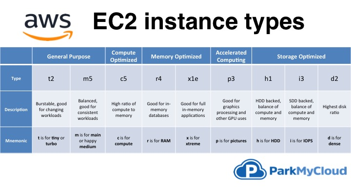
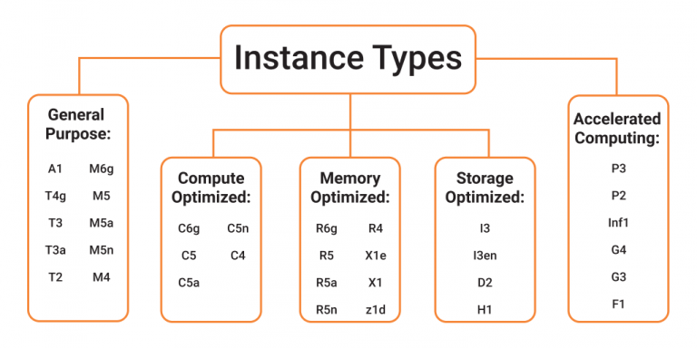

**9. Какие типы инстансов вы знаете?**
    1. Нужно разобраться какие основные типы инстансов есть, мочь идентифицировать их назначение по буквам

**:one: Connect Your Data Center to AWS (Direct Connect)**

   - **:one: Memory-Optimized Instances** : 

     - are geared for workloads that need huge datasets to be processed in memory.

     - memory here defines RAM which allows us to do multiple tasks at a time. 

     - it stores all of the data and instructions that a central processing unit (CPU) needs to perform tasks. 

     - a computer program or application must be loaded from storage into memory before it can run. 

     - this process of preloading gives the CPU direct access to the computer program. 

     - assume you have a workload that necessitates the preloading of significant volumes of data prior to executing an application. 

     - a high-performance database or a task that requires real-time processing of a significant volume of unstructured data might be involved in this scenario. 

     - in this case, consider using a memory-optimized instance. 

     - memory-optimized instances allow you to run applications that require a lot of memory and still get exceptional performance.

    **Examples:**

    - If your application uses a relational or non-relational database and needs to handle data quickly.
    - Processes that do not need a big quantity of data yet require speedy and real-time processing. 

   - **:two: Compute-Optimized Instances:**

     - are appropriate for applications that require a lot of computation and help from high-performance CPUs. 

     - you may employ compute-optimized instances for workloads including web, application, and gaming servers just like general purpose instances. 

     - compute-optimized programs, on the other hand, are best suited for high-performance web servers, compute-intensive application servers, and dedicated gaming servers. 

     - compute-optimized instances can also be used for batch processing workloads that require processing several transactions in a single group.

    **Examples:**

    - applications that require high server performance or that employ a machine learning model will benefit from compute-optimized instances.
      
    - if you have some batch processing workloads or high-performance computing.   

   - **:three:General-Purpose Instances:** 
     - the computation, memory, and networking resources in general-purpose instances are balanced.

     - where you can use General Purpose Instances, are gaming servers, small databases, personal projects, etc. 
    
     - assume you have an application with a kind of equal computing, memory, and networking resource requirements.
    
     - because the program does not require optimization in any particular resource area, you can use a general-purpose instance to execute it.

    **Examples:**
    
    - the applications that require computing, storage, networking, server performance, or want something from everything, can utilize general-purpose instances.
      
    - if high-performance CPUs are not required for your applications, you can go for general purpose instances.

   - **:four:Storage Optimized Instances:**
     - storage optimized instances are made for workloads that demand fast, sequential read and write access to huge datasets.
     
     - distributed file systems, data warehousing applications, and high-frequency online transaction processing (OLTP) systems are examples of workloads that are suited for storage-optimized instances. 
     
     - storage optimized instances are built to provide applications with the lowest latency while accessing the data.

    **Examples:**

    - the applications which high processing of databases, can utilize storage optimized instances.
    
    - data Warehousing applications or distributed file systems can use it.

   - **:five: Accelerated Computing Instances:** 
     - coprocessors are used in accelerated computing instances to execute specific operations more effectively than software running on CPUs. 
    
     - floating-point numeric computations, graphics processing, and data pattern matching are examples of these functions. 
    
     - a Hardware-Accelerator/ Co-processor is a component in computing that may speed up data processing. Graphics applications, game streaming, and application streaming are all good candidates for accelerated computing instances.

    **Examples:**

    - if the application utilizes floating-point calculations or graphics processing, accelerated computing instances will be the best amongst all.
     
    - also, data pattern matching can be done more efficiently with this instance type.

**resources:**
 - [Choosing the Right EC2 Instance Type for Your Application](https://aws.amazon.com/blogs/aws/choosing-the-right-ec2-instance-type-for-your-application/)
 - [EC2 Instance Types Comparison (and how to remember them)](https://jaychapel.medium.com/ec2-instance-types-comparison-and-how-to-remember-them-bbb96b578aea)
 - https://aws.amazon.com/ec2/instance-types/