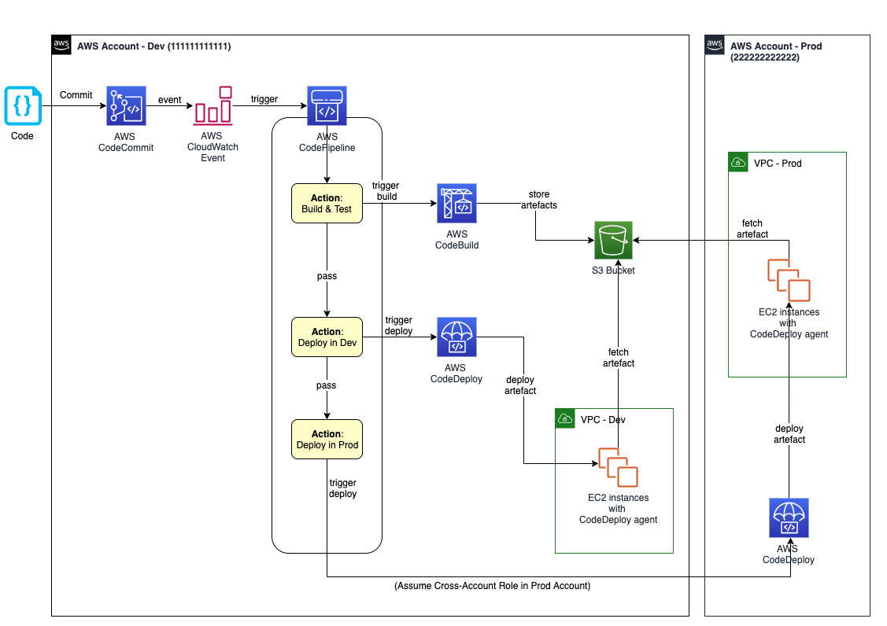

**Continuous Integration and Continuous Delivery (CI/CD) pipeline on AWS**.
- a **pipeline** helps you automate steps in your software delivery process, 
- such as initiating automatic builds and then deploying to Amazon EC2 instances. 
- it can be used **AWS CodePipeline**, a service that 
  - builds, 
  - tests, 
  - deploys your code every time there is a code change, based on the release process models you define. 
- use **CodePipeline** to orchestrate each step in your release process. 
- as part of your setup, you will plug other AWS services into **CodePipeline** to complete your software delivery pipeline. 

**:one: AWS CodeCommit** – 
- a fully-managed source control service that hosts secure Git-based repositories. 
- **codeCommit** makes it easy for teams to collaborate on code in a secure and highly scalable ecosystem. 
- this solution uses CodeCommit to create a repository to store the application and deployment codes.

**:two: AWS CodeBuild** – 
- a fully managed continuous integration service that compiles source code, runs tests, and produces software packages that are ready to deploy, on a dynamically created build server. 
- this solution uses CodeBuild to build and test the code, which we deploy later.

**:three: AWS CodeDeploy** – 
- a fully managed deployment service that automates software deployments to a variety of compute services such as Amazon EC2, AWS Fargate, AWS Lambda, and your on-premises servers. 
- this solution uses CodeDeploy to deploy the code or application onto a set of EC2 instances running CodeDeploy agents.

**:four: AWS CodePipeline** – 
- a fully managed continuous delivery service that helps you automate your release pipelines for fast and reliable application and infrastructure updates. 
- this solution uses CodePipeline to create an end-to-end pipeline that fetches the application code from CodeCommit, builds and tests using CodeBuild, and finally deploys using CodeDeploy.

**:five: AWS CloudWatch Events** – 
- an AWS CloudWatch Events rule is created to trigger the CodePipeline on a Git commit to the CodeCommit repository.

**Amazon Simple Storage Service** (Amazon S3) – 
- an object storage service that offers industry-leading scalability, data availability, security, and performance. 
- this solution uses an S3 bucket to store the build and deployment artifacts created during the pipeline run.

**AWS Key Management Service** (AWS KMS) – 
- AWS KMS makes it easy for you to create and manage cryptographic keys and control their use across a wide range of AWS services and in your applications. 
- this solution uses AWS KMS to make sure that the build and deployment artifacts stored on the S3 bucket are encrypted at rest.

